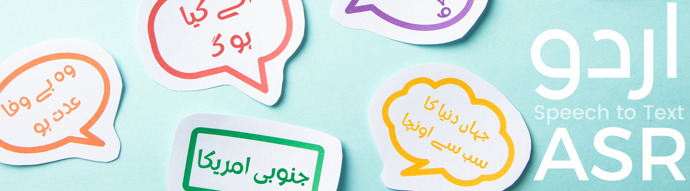
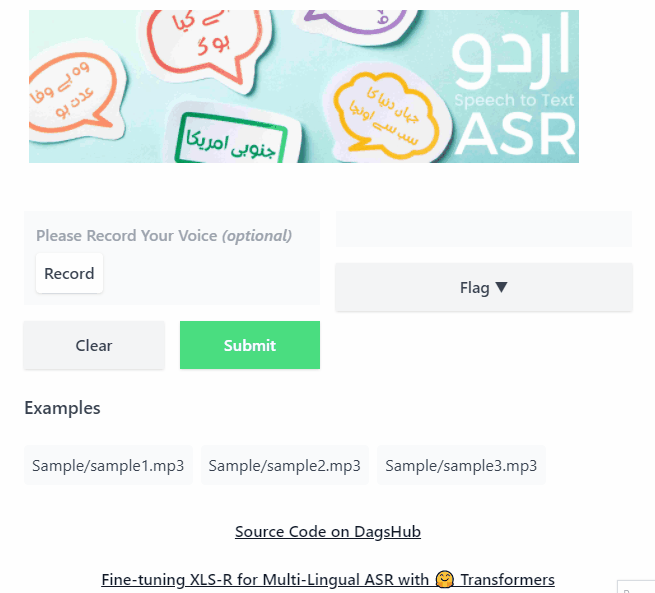

# Urdu Automatic Speech Recognition State of the Art Solution



In the Automatic Speech Recognition (ASR) project, I am finetuning Facebook's wav2vec2-xls-r-300m model on Mozilla-foundation common_voice_8_0 Urdu Dataset.

> **Note:** The Urdu dataset is limited to 3 hours of data, and it is not enough to achieve better results.

It took a while to understand what I was missing. The WER and the training losses were not decresing. So, I started focusing on text processing and hyperparameter optimization. To achieve the state-of-the-art status, I trained the model on 200 `Epochs` which took 4 hours on **4 V100 GPUs** (OVH Cloud). Finally, I have boosted the wav2vec2 model using the ngrams language model. The final results improved drastically from **56** to **46** WER.

## Model Finetunning

[](https://colab.research.google.com/drive/1BUT8dCgzlV3dqv5YgDD7lp6_t680mKQ5?usp=sharing)

This model is a fine-tuned version of [facebook/wav2vec2-xls-r-300m](https://huggingface.co/facebook/wav2vec2-xls-r-300m) on the [common_voice dataset](https://commonvoice.mozilla.org/en/datasets). You can easily download the dataset from the source and load the dataset using the HuggingFace **Dataset** library.

The following results we achieved on the evaluation set:

- Loss: 0.9889
- Wer: 0.5607
- Cer: 0.2370

## Quick Start

Clone Repository using 🦩[FastDS](https://github.com/DAGsHub/fds) and install dependecies using `requirment.txt` file.

```bash
pip install fastds
fds clone https://dagshub.com/kingabzpro/Urdu-ASR-SOTA.git
cd Urdu-ASR-SOTA
pip install -r requirements.txt
```

Finally, run the command to transcribe urdu audio file.👇

```python
from datasets import load_dataset, Audio
from transformers import pipeline
model = "Model"
data = load_dataset("Data", "ur", split="test", delimiter="\t")
def path_adjust(batch):
    batch["path"] = "Data/ur/clips/" + str(batch["path"])
    return batch
data = data.map(path_adjust)
sample_iter = iter(data.cast_column("path", Audio(sampling_rate=16_000)))
sample = next(sample_iter)

asr = pipeline("automatic-speech-recognition", model=model)
prediction = asr(
            sample["path"]["array"], chunk_length_s=5, stride_length_s=1)
prediction
# => {'text': 'اب یہ ونگین لمحاتانکھار دلمیں میںفوث کریلیا اجائ'}
```

## Evaluation Commands

Run evaluation on `CommonVoice V8` with split `test`, you can copy and past the command to the terminal.

> **Note:** You don't need to download the dataset and model to run the evaluation. Everything is handled by FastDS.

```bash
python3 eval.py --model_id Model --dataset Data --config ur --split test --chunk_length_s 5.0 --stride_length_s 1.0 --log_outputs
```

**OR**

Run the simple shell script

```bash
bash run_eval.sh
```

## Language Model

The model performance has increased by combining the Urdu language model. To learn about ngrams check out this tutorial: [Boosting Wav2Vec2 with n-grams in 🤗 Transformers](https://huggingface.co/blog/wav2vec2-with-ngram).

> **Note:** You can use a better language dataset to improve the model performance.

**To achieve state of the art, follow these steps:**

- Get suitable Urdu text data for a language model
- Build an n-gram with KenLM
- Combine the n-gram with a fine-tuned Wav2Vec2 checkpoint

> **Note:** Before running ngram notebook or eval.py, install `kenlm` and `pyctcdecode` packages.

```bash
pip install https://github.com/kpu/kenlm/archive/master.zip pyctcdecode
```

## Eval Results

You can see the clear advanctage of using language model. With language model then the WER is reduced from 56 to 46.

| Without LM | With LM |
| ---------- | ------- |
| 56.21      | 46.37   |

## Directory Structure

The **Data** folder contains `ur` folder, which has TSV's and audio files. The **Model** contains checkpoints, a language model, and tokenizers. The **Eval Results** contains with and without LM results.

```
<root directory>
    |
    .- README.md
    |
    .- Data/
    |
    .- Model/
    |
    .- Images/
    |
    .- Sample/
    |
    .- Gradio/
    |
    .- Eval Results/
          |
          .- With LM/
          |
          .- Without LM/
          | ...
    .- notebook.ipynb
    |
    .- run_eval.sh
    |
    .- eval.py

```

## Gradio App

I have simply added HuggingFace Spaces remote to the `app` branch and pulled the model files using DVC. Read the [blog post](https://medium.com/towards-data-science/deploying-gradio-app-on-spaces-using-dagshub-a-beginners-tutorial-a42664abcc14) to learn more about deploying Gradio app on Spaces using DVC.

> **Note:** The source code for Gradio is available at [app](https://dagshub.com/kingabzpro/Urdu-ASR-SOTA/src/app) branch. I cannot merge it to the `master` branch due to metadata in README.md.

Try out the WebApp on HuggingFace Spaces 👉 [
Urdu-ASR-SOTA Gradio App](https://huggingface.co/spaces/kingabzpro/Urdu-ASR-SOTA)



## Contributing Guide

I want to reach out to the community and make this project open-source. If you have any suggestions or bug reports, please feel free to open an issue or create a pull request.

I am looking for contribution in the following areas:

- [x] Add Language Model
- [x] Webapp/API
- [ ] Denoise Audio
- [ ] Text Processing
- [ ] Spelling Mistakes
- [x] Hyperparameters optimization
- [ ] Training on 300 Epochs & 64 Batch Size
- [ ] Improved Language Model
- [ ] Contribute to Urdu ASR Audio Dataset

All the contributors with the above mentioned contributions will be listed in the **Contributors** section in README.md.

## Robust Speech Recognition Challenge 2022

This project was the result of HuggingFace [Robust Speech Recognition Challenge](https://discuss.huggingface.co/t/open-to-the-community-robust-speech-recognition-challenge/13614). I was one of the winners with four state of the art ASR model.

> Have a look at the models and test them out if you speak the language. I would love to hear your feedback.

- **[Urdu](https://huggingface.co/kingabzpro/wav2vec2-large-xls-r-300m-Urdu)**
- **[Arabic](https://huggingface.co/kingabzpro/wav2vec2-large-xlsr-300-arabic)**
- **[Punjabi](https://huggingface.co/kingabzpro/wav2vec2-large-xlsr-53-punjabi)**
- **[Irish](https://huggingface.co/kingabzpro/wav2vec2-large-xls-r-1b-Irish)**


## References

- [Common Voice Dataset](https://commonvoice.mozilla.org/en/datasets)
- [XLS-R: Self-supervised Cross-lingual Speech Representation Learning at Scale](https://arxiv.org/abs/2111.09296)
- [Sequence Modeling With CTC](https://distill.pub/2017/ctc/)
- [Fine-tuning XLS-R for Multi-Lingual ASR with 🤗 Transformers](https://huggingface.co/blog/fine-tune-xlsr-wav2vec2)
- [Boosting Wav2Vec2 with n-grams in 🤗 Transformers](https://huggingface.co/blog/wav2vec2-with-ngram)
- [HF Model](https://huggingface.co/kingabzpro/wav2vec2-large-xls-r-300m-Urdu)

## License

The dataset is under Public Domain, [CC-0](https://creativecommons.org/share-your-work/public-domain/cc0/) license and model is under [APACHE-2.0](https://www.apache.org/licenses/LICENSE-2.0.html).

## Citation

Data Citation

```bib
@inproceedings{commonvoice:2020,
  author = {Ardila, R. and Branson, M. and Davis, K. and Henretty, M. and Kohler, M. and Meyer, J. and Morais, R. and Saunders, L. and Tyers, F. M. and Weber, G.},
  title = {Common Voice: A Massively-Multilingual Speech Corpus},
  booktitle = {Proceedings of the 12th Conference on Language Resources and Evaluation (LREC 2020)},
  pages = {4211--4215},
  year = 2020
}
```

Model Citation

```bib
@article{DBLP:journals/corr/abs-2111-09296,
  author    = {Arun Babu and
               Changhan Wang and
               Andros Tjandra and
               Kushal Lakhotia and
               Qiantong Xu and
               Naman Goyal and
               Kritika Singh and
               Patrick von Platen and
               Yatharth Saraf and
               Juan Pino and
               Alexei Baevski and
               Alexis Conneau and
               Michael Auli},
  title     = {{XLS-R:} Self-supervised Cross-lingual Speech Representation Learning
               at Scale},
  journal   = {CoRR},
  volume    = {abs/2111.09296},
  year      = {2021},
  url       = {https://arxiv.org/abs/2111.09296},
  eprinttype = {arXiv},
  eprint    = {2111.09296},
  timestamp = {Mon, 22 Nov 2021 16:44:07 +0100},
  biburl    = {https://dblp.org/rec/journals/corr/abs-2111-09296.bib},
  bibsource = {dblp computer science bibliography, https://dblp.org}
}
```
